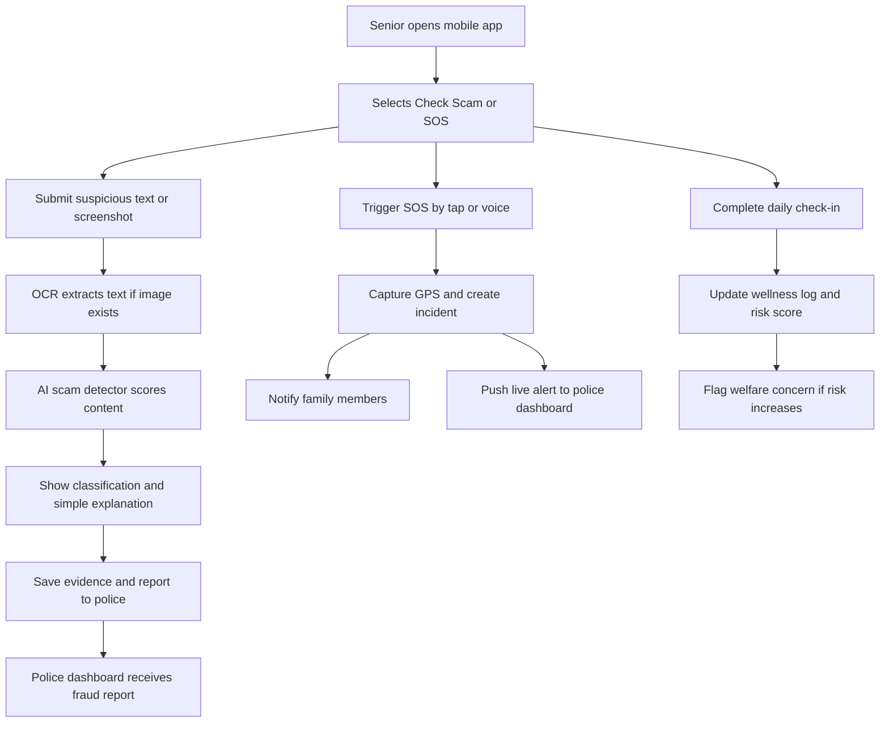

## 1. Product Overview
RakshakAI is a cyber-aware safety and welfare platform for senior citizens that combines scam detection, emergency response, and welfare monitoring in one connected system.
- It helps seniors verify suspicious messages, trigger one-tap or voice SOS, and stay connected with family members and police through a unified experience.
- It creates hackathon-ready value by combining social impact, AI assistance, and live operational visibility for authorities.

## 2. Core Features

### 2.1 User Roles
| Role | Registration Method | Core Permissions |
|------|---------------------|------------------|
| Senior Citizen | Mobile OTP + PIN | Submit fraud reports, trigger SOS, complete wellness check-ins, view alerts |
| Family Member | Mobile OTP | Receive alerts, review senior wellbeing, manage emergency contacts |
| Police Officer | Secure login | View incidents, review evidence, track fraud cases, analyze trends |

### 2.2 Feature Module
1. **Mobile Authentication**: OTP login, lightweight PIN flow, profile setup
2. **Senior Home Dashboard**: large quick actions, reminders, recent alerts, safety tips
3. **AI Scam Detector**: text analysis, screenshot OCR, risk classification, plain-language explanation, evidence saving
4. **Emergency SOS**: one-tap SOS, voice-triggered SOS, location sharing, family notification, police incident creation
5. **Daily Wellness Check-In**: simple health and safety questions, risk scoring, missed check-in alerts
6. **Family Monitoring View**: alert feed, contact management, wellbeing summary
7. **Police Dashboard**: summary metrics, live incidents, fraud reports, case review, heatmap analytics

### 2.3 Page Details
| Page Name | Module Name | Feature description |
|-----------|-------------|---------------------|
| Splash Screen | Branding | App logo, name, emergency safety tagline, quick loading transition |
| Login Screen | Authentication | Mobile OTP entry, PIN input, optional biometric placeholder, accessible large controls |
| Home Dashboard | Primary Actions | Giant SOS button, Check Scam button, Daily Check-In button, recent alerts, reminder card |
| SOS Screen | Emergency Trigger | One-tap SOS, voice SOS listen state, GPS capture, emergency contacts, alert status |
| Scam Detector Screen | Multi-input Analysis | Paste suspicious message, upload screenshot, record voice note placeholder |
| Scam Result View | Risk Explanation | Score, classification, simple explanation, recommended action, save evidence, report to police |
| Daily Wellness Check | Welfare Logging | Safety, health, assistance questions, quick responses, confirmation state |
| Profile Screen | Personal Settings | Medical conditions, medications, language, address, emergency contacts |
| Family Alerts Screen | Monitoring | Alert list, current wellbeing status, emergency contacts summary |
| Police Dashboard Home | Command Summary | KPI cards for active SOS, fraud reports, high-risk seniors, open investigations |
| Incident Monitor | Live Feed | Real-time incident stream with name, location, time, severity, status |
| Fraud Investigation Panel | Evidence Review | Message text, screenshot, OCR text, AI score, explanation, actions |
| Risk Heatmap | Geographic Intelligence | OpenStreetMap heatmap for SOS and scam hotspot visualization |

## 3. Core Process
The main flow starts when a senior opens the app and chooses between checking a suspicious message or raising an emergency SOS. For scam detection, the senior submits text or a screenshot, the AI pipeline analyzes the content, and the system returns a risk score with a simple explanation and recommended action. If needed, the user saves evidence and files a report that immediately appears in the police dashboard.

The emergency flow allows a senior to trigger SOS manually or by voice. The system captures the location, stores an incident, notifies connected family members, and pushes a live update to the police dashboard. Wellness check-ins run as a lighter supporting flow that helps identify non-emergency welfare risks and surfaces them to family or police when needed.

## 4. User Interface Design
### 4.1 Design Style
- Primary colors: deep navy, soft ivory, trusted teal, emergency red
- Button style: extra-large rounded buttons with strong contrast and subtle shadows
- Fonts and sizes: bold display font for headings, clean readable sans-serif for body, oversized touch-friendly text
- Layout style: card-based layout with spacious padding, large action zones, and low cognitive load
- Icon style suggestions: simple outlined icons with clear labels and status badges

### 4.2 Page Design Overview
| Page Name | Module Name | UI Elements |
|-----------|-------------|-------------|
| Home Dashboard | Quick Action Panel | Three large vertically stacked buttons, bold labels, strong contrast, subtle animated highlights |
| Home Dashboard | Alert Cards | Rounded cards with severity color accents, timestamp, and short summaries |
| SOS Screen | SOS Trigger | Dominant red circular button, voice activation card, location status chip, contact badges |
| Scam Detector Screen | Input Methods | Tabbed input mode, drag-and-drop upload area, large text box, primary CTA |
| Scam Result View | Risk Display | Circular score meter, classification badge, explanation card, recommendation card |
| Daily Wellness Check | Question Cards | Step-by-step cards with large yes/help buttons and reassuring confirmation |
| Police Dashboard Home | KPI Grid | High-contrast metric cards, trend labels, clean shadows, compact but readable data density |
| Incident Monitor | Live List | Real-time table, severity pills, status dropdown, quick open-details action |
| Fraud Investigation Panel | Evidence Console | Side-by-side screenshot preview, extracted text, AI explanation, case actions |
| Risk Heatmap | Map View | Dark sidebar plus light map balance, layer toggles, location markers, heat intensity legend |

### 4.3 Responsiveness
The mobile app uses a mobile-first accessible layout with large touch targets and minimal form friction. The police dashboard uses a desktop-first layout with responsive collapse for tablet screens. All key actions remain visible without requiring deep navigation, and typography scales for readability across devices.
