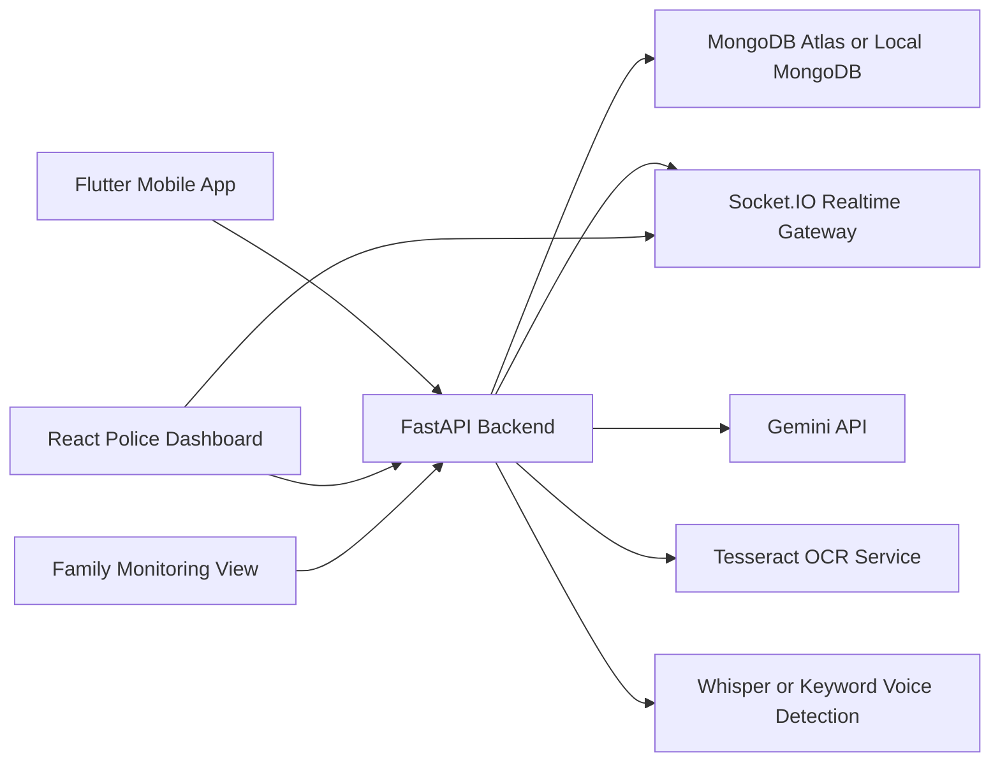
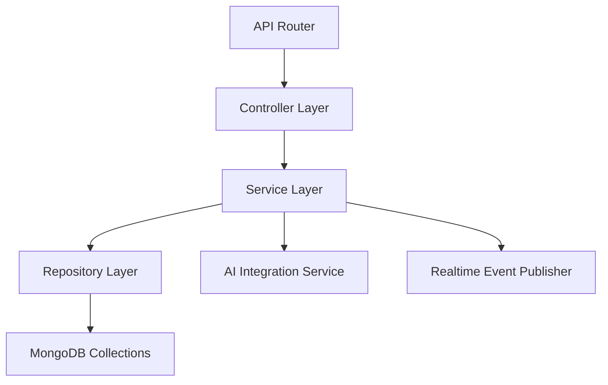
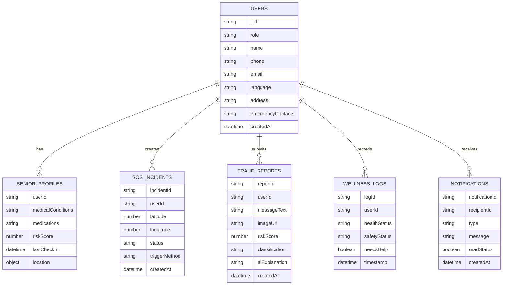

## 1. Architecture Design


## 2. Technology Description
- Frontend Mobile: Flutter with Provider for state management and responsive accessible UI
- Dashboard Frontend: React@18 + Vite + Tailwind CSS + React Router + Recharts + Leaflet
- Backend: FastAPI + Pydantic + Motor + Python Socket.IO server
- Database: MongoDB with collections for users, profiles, incidents, reports, wellness logs, notifications
- Realtime: Socket.IO for live incident and fraud report updates
- AI Services: Gemini API for scam analysis, Tesseract OCR for screenshots, Whisper or fallback keyword detection for voice SOS
- Initialization Approach: monorepo with separate `frontend-mobile`, `backend`, and `dashboard` applications

## 3. Route Definitions
| Route | Purpose |
|-------|---------|
| / | Dashboard landing and summary cards |
| /incidents | Live SOS incident monitor |
| /fraud-reports | Fraud investigation panel |
| /heatmap | Risk heatmap with geographic overlays |
| /seniors | High-risk seniors and welfare flags |
| /login | Police login page |

## 4. API Definitions

### 4.1 Authentication
```ts
type LoginRequest = {
  phone: string;
  role: "senior" | "family" | "police";
};

type VerifyOtpRequest = {
  phone: string;
  otp: string;
};

type AuthResponse = {
  success: boolean;
  message: string;
  data: {
    token: string;
    user: {
      id: string;
      role: "senior" | "family" | "police";
      name: string;
      phone: string;
    };
  };
};
```

### 4.2 Fraud Analysis
```ts
type FraudAnalyzeRequest = {
  messageText?: string;
  imageBase64?: string;
};

type FraudAnalyzeResponse = {
  success: boolean;
  message: string;
  data: {
    extractedText?: string;
    riskScore: number;
    classification: "SAFE" | "SUSPICIOUS" | "SCAM";
    aiExplanation: string;
    recommendedAction: string;
  };
};
```

### 4.3 SOS
```ts
type SosCreateRequest = {
  userId: string;
  latitude: number;
  longitude: number;
  triggerMethod: "BUTTON" | "VOICE";
};

type SosResponse = {
  success: boolean;
  message: string;
  data: {
    incidentId: string;
    status: "OPEN" | "IN_PROGRESS" | "RESOLVED";
    latitude: number;
    longitude: number;
    createdAt: string;
  };
};
```

### 4.4 Wellness
```ts
type WellnessCheckInRequest = {
  userId: string;
  safetyStatus: "SAFE" | "NEED_HELP";
  healthStatus: "HEALTHY" | "NEED_HELP";
  needsHelp: boolean;
};
```

## 5. Server Architecture Diagram


## 6. Data Model
### 6.1 Data Model Definition


### 6.2 Data Definition Language
```js
db.users.createIndex({ phone: 1 }, { unique: true });
db.seniorProfiles.createIndex({ userId: 1 }, { unique: true });
db.sosIncidents.createIndex({ createdAt: -1 });
db.sosIncidents.createIndex({ status: 1, createdAt: -1 });
db.fraudReports.createIndex({ userId: 1, createdAt: -1 });
db.fraudReports.createIndex({ classification: 1, createdAt: -1 });
db.wellnessLogs.createIndex({ userId: 1, timestamp: -1 });
db.notifications.createIndex({ recipientId: 1, createdAt: -1 });
```

## 7. Implementation Notes
- Start with a hackathon-grade full MVP that works with seeded data and mock OTP to reduce setup risk.
- Use environment-driven AI adapters so Gemini, OCR, and voice modules can run in demo mode when keys or binaries are unavailable.
- Provide reusable design tokens for dashboard and mobile UI so the product looks cohesive across platforms.
- Keep Socket.IO events consistent: `sos:new`, `sos:updated`, `fraud:new_report`, and `wellness:risk_flag`.
